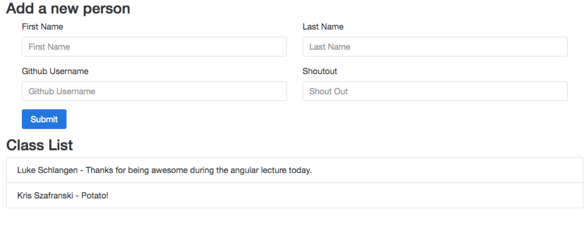

# Angular Intro
The goal of this assignment is to update the index.html file to add a new person to the array and display the first name, last name, and shoutout in their own row.

## Hard Mode
Each person has a github account being added, but it is not being used anywhere. Make it so that when someone clicks on a name, they are brought to that user's github account. It may help to research ng-href in order to do this.

## Pro Mode
Include a search bar that allows a user to a find a person by their first or last name. It may help to research angular's ng-repeat filters (they look like this `| filter:`), in order to do this.
